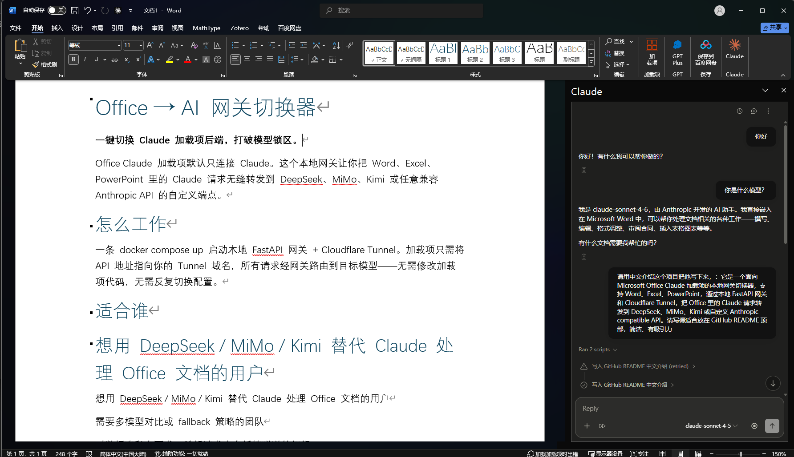
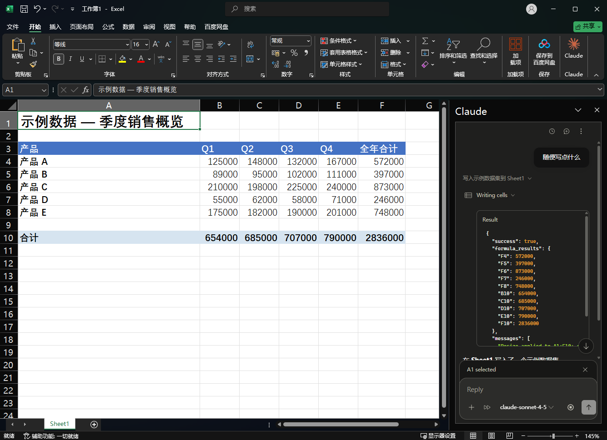
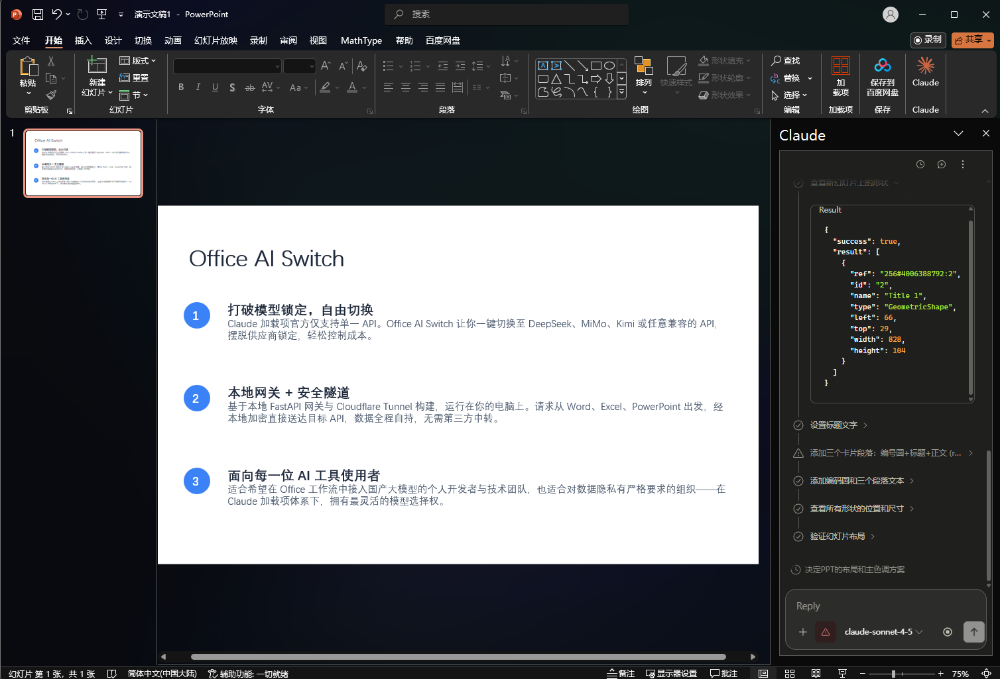

# Office AI Switch

> 一个面向 **Claude for Microsoft Office 加载项** 的本地网关 + 配置管理套件。
> 用桌面 GUI / CLI 一键管理多家上游（DeepSeek、Kimi、MiMo、MiniMax、OpenRouter、SiliconFlow、AiHubMix、DMXAPI、自定义中转站），让 Word / Excel / PowerPoint 里的 Claude 加载项稳定路由到任意 Anthropic 兼容端点。

> [!important]
> 当前稳定支持 **Anthropic-compatible Messages API**。`openai_chat`、`openai_responses`、`gemini_native` 等格式字段已预留，但协议转换尚未完整实现，不能把它们当成已稳定支持。


## Download

Windows 用户可以直接下载 Release 包：

[OfficeAISwitch-v2.0.0-win-x64.zip](https://github.com/wante30/office-ai-switch/releases/download/v2.0.0/OfficeAISwitch-v2.0.0-win-x64.zip)

解压后双击 `OfficeAISwitch.exe`。首次启动会自动创建本地 Python 虚拟环境并安装网关依赖。

首次使用、导出 manifest.xml、导入 Word / Excel / PowerPoint 的步骤见 [USER_GUIDE.md](USER_GUIDE.md)。

没有自有域名也可以先试用：本机网关启动后，用 `cloudflared tunnel --url http://127.0.0.1:8790` 生成临时 `trycloudflare.com` HTTPS 地址，再把它填进 manifest。详细步骤见 [docs/GATEWAY_SETUP.md](docs/GATEWAY_SETUP.md#41-没有域名时临时-trycloudflare-试用)。

## Screenshots

| Provider switcher | Word |
|---|---|
|  |  |

| Excel | PowerPoint |
|---|---|
|  |  |

---

## 1. 项目简介

`Office AI Switch` 解决一个很现实的问题：**Claude 的 Office 加载项只能填一个 Enterprise Gateway URL，但用户往往同时拥有多家 API 供应商的 Key，想在 Word / Excel / PowerPoint 里随时切换、批量测试、稳定使用**。

项目早期名为 `Word AI Switch v2`，当前脚本仍保留 `word-switch-v2.py` / `word-switch-v2-gui.ps1` 文件名，避免破坏已有用户环境。对外开源名称建议使用 **Office AI Switch**。

本项目把"切供应商"从手改 `.env` + 重启服务，变成 GUI 一次点击：

- 左侧：配置列表，每条 profile 一目了然（名称、Key 状态、模型映射）。
- 右侧：详情编辑、保存、自动配置、测试、应用到网关。
- 底部：操作日志，所有动作可追溯。

底层由一个本地 FastAPI 网关（`gateway_unified`）对外暴露固定的 Anthropic Messages API（`/v1/messages`、`/v1/models`、`/healthz`），加一个 Cloudflare Tunnel 把本机服务暴露成 HTTPS 公网入口，供 Office 加载项调用。

从零配置 Cloudflare Tunnel、DNS、Office manifest 和 Enterprise Gateway URL，请先看 [docs/GATEWAY_SETUP.md](docs/GATEWAY_SETUP.md)。

### 1.1 它适合谁

- 想在 Word / Excel / PowerPoint 里用 Claude，但不想被官方套餐绑死的个人开发者。
- 同时持有 DeepSeek、Kimi、MiMo 等多家 Key，想按场景切换的人。
- 用中转站 / 自建网关，但每次换供应商都要手改环境变量的人。
- 给小团队提供一个稳定入口，多人共用一台机器做转发的人。

### 1.2 它不适合谁

- 只想用官方 Claude API、不需要切换的人（直接用官方加载项即可）。
- 想要 Linux/macOS 桌面 GUI 的人（当前 GUI 是 WinForms + PowerShell，仅 Windows）。
- 想要 100% 协议覆盖（Gemini Native、OpenAI Responses 等非 Anthropic 格式）的人（当前网关只稳定支持 Anthropic Messages）。

---

## 2. 架构总览


```text
┌─────────────────────────────────────────────────────────────────┐
│ Microsoft Office                                                │
│   ├─ Word                                                       │
│   ├─ Excel                                                      │
│   └─ PowerPoint                                                 │
│      Claude 加载项（manifest.xml 指向 Enterprise Gateway URL）  │
└───────────────────────────────┬─────────────────────────────────┘
                                │ HTTPS
                                ▼
                  https://word.example.com
                                │
                  ┌─────────────┴─────────────┐
                  │  Cloudflare Tunnel        │
                  │  (cloudflared.exe)        │
                  └─────────────┬─────────────┘
                                │ http://127.0.0.1:8790
                                ▼
                  ┌─────────────────────────────┐
                  │  gateway_unified (FastAPI)  │
                  │  - /v1/messages             │
                  │  - /v1/models               │
                  │  - /healthz                 │
                  │  - 输入清洗 / 日志脱敏      │
                  │  - Web Search 自动回路      │
                  └─────────────┬─────────────┘
                                │
            ┌───────────────────┼───────────────────┐
            ▼                   ▼                   ▼
      DeepSeek 官方       OpenRouter           自定义中转站
      Kimi / MiMo         SiliconFlow         (任意 Anthropic 兼容)
      MiniMax             AiHubMix / DMXAPI
```

### 2.1 三层职责

| 层 | 组件 | 职责 |
|---|---|---|
| 客户端 | Office 加载项 + manifest XML | 在 Word / Excel / PowerPoint 里调出 Claude 面板，请求发往 Enterprise Gateway URL |
| 入口 | `cloudflared.exe` + FastAPI 网关 | HTTPS 终结、请求清洗、模型别名映射、上游路由 |
| 管理 | `word-switch-v2.py` CLI + `word-switch-v2-gui.ps1` GUI | 配置管理、API Key 加密存储、批量测试、应用到网关 |

### 2.2 数据存放

所有用户状态都放在 `%USERPROFILE%\.word-switch-v2\`：

| 文件 | 内容 |
|---|---|
| `profiles.json` | 所有 profile（schema v3，含 baseUrl、apiFormat、routes 等） |
| `secrets.json` | API Key，使用 Windows DPAPI 加密（只能当前用户/当前机器解密） |
| `state.json` | 当前 active profile、网关状态缓存 |
| `backups/` | 每次写操作前自动备份的 `.bak` 文件 |

---

## 3. 功能特性

### 3.1 GUI（`word-switch-v2-gui.ps1`）

- **左侧配置列表**：实时显示名称、Key 状态、当前模型映射，支持搜索过滤。
- **右侧详情面板**：名称、Base URL、Preset、API 格式、模型路由、API Key、备注。
- **一键操作**：
  - 新建配置
  - 保存配置 / 保存 Key（分开保存，避免误覆盖）
  - 自动配置（拉 `/v1/models` 推荐模型映射）
  - 测试选中配置（直接打上游，验证 Key + 模型）
  - 应用到 Word 网关（重启 gateway + tunnel）
  - 测试公网入口（验证 Cloudflare Tunnel 链路）
  - 复制配置（基于现有 profile 派生新配置）
  - 删除配置（同时清理 secret）
  - 批量测试（一次测全部 profile）
  - 启动 / 修复网关
- **底部状态栏**：本地网关状态、公网入口、当前 active profile、`sonnet` 实际指向的模型。
- **操作日志**：每次动作的时间戳 + 结果，便于排障。
- **自适应布局**：左侧栏随窗口高度滚动，主面板随窗口宽度拉伸。

### 3.2 CLI（`word-switch-v2.py`）

完整命令组（schema v3）：

```text
word-switch-v2.py init                              # 初始化状态目录与默认配置
word-switch-v2.py profile list [--json]             # 列出所有 profile
word-switch-v2.py profile get <id>                  # 查看单个 profile
word-switch-v2.py profile save [--stdin] [--json]   # 保存/更新 profile
word-switch-v2.py profile auto-configure <id>       # 拉模型列表自动推荐映射
word-switch-v2.py profile test <id>                 # 测试单个 profile
word-switch-v2.py profile delete <id>               # 删除 profile + secret
word-switch-v2.py secret save <id> [--stdin]        # 保存 API Key（DPAPI 加密）
word-switch-v2.py secret status <id>                # 查看 Key 状态（仅掩码）
word-switch-v2.py gateway apply <id>                # 应用 profile 并重启网关
word-switch-v2.py gateway status [--local] [--full] # 网关状态
word-switch-v2.py gateway test-public               # 公网入口连通性
word-switch-v2.py gateway start                     # 启动网关 + tunnel
word-switch-v2.py preset-list                       # 内置供应商预设
word-switch-v2.py migrate-v1                        # 从 v1 迁移
word-switch-v2.py ui [--port 8791]                  # 内置 Web UI（轻量）
```

旧命令 `list / status / add / use / test / fetch-models / start` 保留为别名，兼容老脚本。

### 3.3 网关（`gateway_unified`）

- 固定对外接口：`/healthz`、`/v1/models`、`/v1/messages`。
- Provider 路由：`deepseek / kimi / mimo / minimax / auto`，按 API Key 前缀分流。
- 模型别名稳定映射：对外只暴露 `opus / sonnet` 双档（`haiku` 兼容映射到 sonnet）。
- Web Search：支持透传模式 + 自动执行模式（本地 DuckDuckGo HTML 搜索 + 工具回路收敛）。
- 输入清洗：请求体大小限制、非法 `thinking` block 降级、`tools/messages/system` 标准化。
- 日志脱敏：默认 `LOG_CONTENT_REDACT=true`，不记录真实消息内容。
- 上游错误泛化：客户端只看到通用错误，服务端日志保留细节。

详见 [README.md](README.md)。

---

## 4. 快速开始

### 4.1 环境要求

- Windows 10 / 11（PowerShell 5.1+）
- Python 3.10+（推荐 3.12）
- `cloudflared.exe`（可选，仅公网入口需要）放在 `%USERPROFILE%\cloudflared.exe`
- Microsoft Office（Word / Excel / PowerPoint，已侧载 Claude 加载项，或用示例 manifest 侧载）

### 4.2 安装

```powershell
# 1. 克隆 / 解压到任意目录，例如 C:\Tools\office-ai-switch
cd C:\Tools\office-ai-switch

# 2. 初始化网关虚拟环境
cd gateway_unified
python -m venv .venv
.\.venv\Scripts\Activate.ps1
pip install -e .
# 或 pip install -r requirements.txt
deactivate
cd ..

# 3. 初始化状态目录
python word-switch-v2.py init
```

### 4.3 启动 GUI

```powershell
# 方式 1：双击或右键"使用 PowerShell 运行"
.\word-switch-v2-gui.ps1

# 方式 2：命令行
powershell -ExecutionPolicy Bypass -File .\word-switch-v2-gui.ps1
```

### 4.4 典型首次使用流程

1. 启动 GUI，左侧默认有内置预设（DeepSeek、OpenRouter 等）。
2. 点「+ 新建配置」，填名称、Base URL、API Key。
3. 点「自动配置」让程序拉模型列表推荐映射（也可手填 `opus/sonnet/haiku` 对应的上游模型）。
4. 点「保存配置」→「保存 Key」→「测试选中配置」。
5. 测试通过后点「应用到 Word 网关」，等待 gateway + tunnel 重启。
6. 状态栏显示「当前启用：xxx」后，打开 Word / Excel / PowerPoint 中的 Claude 加载项即可使用。

### 4.5 仅启动网关（不需要 GUI）

```powershell
# 用 start.ps1 一键起 gateway + cloudflared 两个窗口
.\start.ps1
```

---

## 5. 配置参考

### 5.1 Profile 结构（schema v3）

```json
{
  "id": "deepseek-official",
  "name": "DeepSeek 官方",
  "presetId": "deepseek",
  "baseUrl": "https://api.deepseek.com/anthropic",
  "apiFormat": "anthropic",
  "routes": {
    "opus": "deepseek-v4-pro",
    "sonnet": "deepseek-v4-flash",
    "haiku": "deepseek-v4-flash"
  },
  "notes": "主用，长文本推理",
  "keyPreview": "sk-abc...wxyz",
  "lastTest": {
    "status": "pass",
    "baseUrl": "https://api.deepseek.com/anthropic",
    "upstreamModel": "deepseek-v4-flash",
    "latencyMs": 842,
    "timestamp": "2026-06-27T13:00:00Z"
  },
  "createdAt": "2026-06-01T00:00:00Z",
  "updatedAt": "2026-06-27T13:00:00Z"
}
```

### 5.2 内置供应商预设

| ID | 名称 | 默认 Base URL | API 格式 |
|---|---|---|---|
| `deepseek` | DeepSeek 官方 | `https://api.deepseek.com/anthropic` | anthropic |
| `openrouter` | OpenRouter | `https://openrouter.ai/api/v1` | openai_chat（预留，需协议转换） |
| `siliconflow` | SiliconFlow | `https://api.siliconflow.cn` | openai_chat（预留，需协议转换） |
| `aihubmix` | AiHubMix | `https://aihubmix.com` | anthropic |
| `dmxapi` | DMXAPI | `https://www.dmxapi.com` | anthropic |
| `custom_gateway` | 自定义网关 / 中转站 | （空，由用户填） | anthropic |

### 5.3 网关 `.env` 关键项

```env
ACTIVE_PROVIDER=deepseek
GATEWAY_PORT=8790
DEEPSEEK_API_KEY=sk-xxx

ENABLE_WEB_SEARCH_TOOL=true
ENABLE_AUTO_WEB_SEARCH_EXECUTION=true
AUTO_WEB_SEARCH_MAX_RESULTS=5
AUTO_WEB_SEARCH_TIMEOUT_SECONDS=20

LOG_CONTENT_REDACT=true
MAX_REQUEST_BODY_BYTES=4194304
```

完整说明见 [README.md](README.md) 第 9 节。

---

## 6. 目录结构

```text
excel-claude-deepseek-gateway-kit/
├── gateway_unified/                # FastAPI 网关
│   ├── src/claude_gateway/
│   │   ├── main.py                 # FastAPI 入口、路由、Web Search 回路
│   │   ├── providers.py            # Provider 路由与模型映射
│   │   ├── sanitize.py             # 请求清洗
│   │   ├── stream.py               # SSE 修正与工具分片聚合
│   │   ├── log_mw.py               # 请求日志与脱敏
│   │   ├── models.py               # /v1/models 构建
│   │   ├── access_auth.py          # 网关访问鉴权
│   │   └── web_search.py           # 本地 DuckDuckGo 搜索
│   ├── claude-gateway-rs/          # Rust 重写版本（实验性）
│   ├── tests/                      # pytest 测试
│   ├── .env.example
│   ├── pyproject.toml
│   └── run-gateway.ps1
├── scripts/
│   └── gateway-wrapper.cjs         # NPM 命令包装
├── word-switch-v2.py               # CLI（schema v3）
├── word-switch-v2-gui.ps1          # WinForms GUI
├── start.example.ps1               # 可公开的启动脚本模板
├── word-deepseek-manifest.example.xml # 可公开的 Office manifest 模板
├── docs/
│   └── GATEWAY_SETUP.md            # 网关 / Cloudflare / DNS / manifest 配置指南
├── package.json                    # NPM 包装（可选）
├── README.md                       # 网关 README
└── WORD_AI_SWITCH_V2_README.md     # 本文档
```

---

## 7. 常见问题

### 7.1 GUI 打开后中文乱码

确认 `word-switch-v2-gui.ps1` 以 UTF-8 保存（默认就是）。PowerShell 5.1 下若仍乱码，先执行：

```powershell
chcp 65001
```

再启动 GUI。

### 7.2 保存 API Key 后测试仍提示"未保存 Key"

- 确认点的是「保存 Key」而不是「保存配置」。两者分开。
- 检查 `%USERPROFILE%\.word-switch-v2\secrets.json` 是否有该 profile 的条目（内容是 DPAPI 密文）。
- 换机器后 `secrets.json` 不可用（DPAPI 绑定当前用户/机器），需重新保存 Key。

### 7.3 「应用到 Word 网关」失败

- 端口 8790 被占用：`netstat -ano | findstr :8790`，杀掉旧进程。
- `.venv` 不存在或损坏：重跑 4.2 节的 venv 创建步骤。
- `cloudflared.exe` 不在 `%USERPROFILE%\cloudflared.exe`：从 <https://github.com/cloudflare/cloudflared/releases> 下载。

### 7.4 Office 加载项打不开 / 显示空白

- 用 `start-word-fixed.ps1` 清理 Office 加载项缓存。
- 确认 `word-deepseek-manifest.xml` 里的 `SourceLocation` 指向你的公网域名。
- Office 完全退出后重新打开（任务管理器确认 `WINWORD.EXE` / `EXCEL.EXE` / `POWERPNT.EXE` 相关进程已结束）。

### 7.5 批量测试全部失败

- 确认 profile 已保存 Key（无 Key 的 profile 一定会失败）。
- 看日志最后一行：`批量测试完成：N 通过 / M 失败`，对比数量。
- 单点「测试选中配置」验证单个 profile 是否能通过。
- 网络/DNS 问题会导致批量测试大面积失败，先确认能 `curl` 上游。

### 7.6 公网入口测试失败但本地测试通过

- `cloudflared.exe` 没启动：用 GUI「启动 / 修复 网关」或 `start.ps1`。
- 域名未指向当前 tunnel：检查 Cloudflare 控制台 DNS。
- Tunnel 配置文件位置：`%USERPROFILE%\.cloudflared\config.yml`。

---

## 8. 已知限制

1. **平台限制**：GUI 仅 Windows。CLI 和网关本身跨平台，但 DPAPI Key 加密是 Windows 专属，Linux/macOS 需自行替换为其他加密方案。
2. **协议覆盖**：网关当前只稳定支持 Anthropic Messages。`openai_chat` / `gemini_native` 等格式可在 profile 中标注，但网关未实现转换前不能真正生效。
3. **Auto 模式歧义**：`ACTIVE_PROVIDER=auto` 下，通用 `sk-*` 默认走 MiMo PAYG，无法自动精确区分 Kimi PAYG。
4. **Web Search**：依赖 DuckDuckGo HTML 页面结构，页面改版可能需要更新解析器；流式场景下不启用自动回路。
5. **批量测试**：当前为串行执行，profile 数量多时耗时较长（每个上游约 1-3 秒）。

---

## 9. 开发与调试

### 9.1 启用调试日志

```powershell
# GUI 启动时带控制台窗口
powershell -ExecutionPolicy Bypass -File .\word-switch-v2-gui.ps1
# 注释掉脚本顶部的 ShowWindow(..., 0) 即可保留控制台
```

### 9.2 直接调 CLI

```powershell
python word-switch-v2.py profile list --json
python word-switch-v2.py profile test deepseek-official
```

### 9.3 直接调网关

```powershell
cd gateway_unified
.\.venv\Scripts\Activate.ps1
uvicorn --app-dir src claude_gateway.main:app --host 127.0.0.1 --port 8790 --reload
```

### 9.4 运行测试

```powershell
cd gateway_unified
pip install -e ".[dev]"
pytest tests/ -v
```

---

## 10. 来源与致谢

这个项目是在现有 Claude / Anthropic 兼容网关思路上整理出来的 Office 场景工具，核心目标是把 Word、Excel、PowerPoint 里的 Claude 加载项接到可切换的本地网关。

- 原始网关参考：[Komikawayi/excel-claude-deepseek-gateway-kit](https://github.com/Komikawayi/excel-claude-deepseek-gateway-kit)。
- 公网入口：[Cloudflare Tunnel](https://developers.cloudflare.com/cloudflare-one/connections/connect-networks/)。
- 上游模型与中转服务：DeepSeek、Kimi、MiMo、MiniMax、OpenRouter、SiliconFlow、AiHubMix、DMXAPI 等。

---

## 11. 许可证

MIT License。详见 [LICENSE](LICENSE)。MIT 是一个宽松的开源许可，主要作用是说明别人可以怎么使用代码，以及作者不对使用结果承担担保责任。
